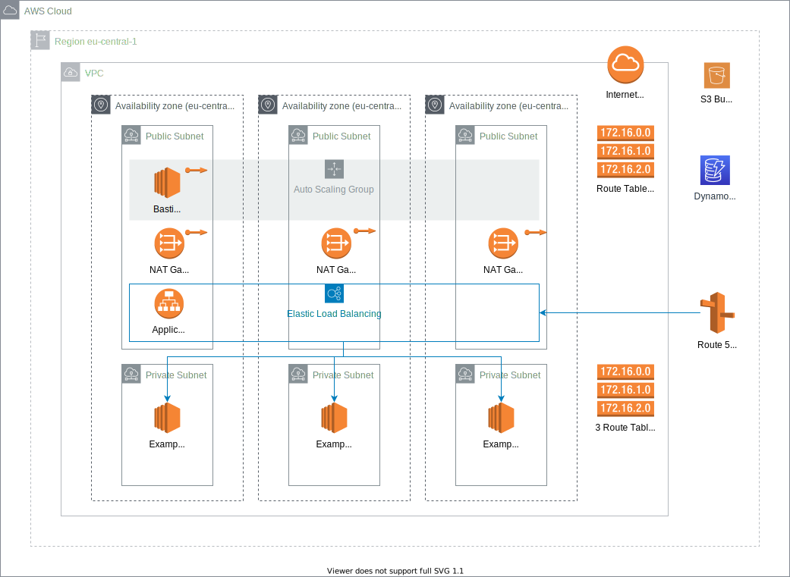

# Terraform AWS Demo

This git repo contains infrastructure as code (terraform) to deploy a standard architecture to AWS.

## Overview

What we will build:


## Prerequisites

- Terraform installed on machine

## Usage

In my demo AWS access_key and secret_key will be automatically loaded from ~/.aws/credentials since i have set that up previously

### 1. Initialize for Remote Management of terraform state and state lock
Folder: 01-state-management

This folder contains files to create following ressources:
- S3 Bucket for storing the terraform state files
- DynamoDB for managing locks of terraform state files

Commands:
```
cd 01-state-management
terraform init
terraform plan
terraform apply
tf_state_region=$(terraform output -raw region)
tf_state_bucket=$(terraform output -raw s3_bucket)
tf_state_dynamodb_table=$(terraform output -raw dynamodb)
```

### 2. Creating infrastructure in AWS
Folder: 02-base-infrastructure

```
cd 02-base-infrastructure
terraform init \
    -backend-config="bucket=$tf_state_bucket" \
    -backend-config="key=terraform-aws-demo.tfstate" \
    -backend-config="region=$tf_state_region" \
    -backend-config="dynamodb_table=$tf_state_dynamodb_table"
terraform plan
terraform apply
```

### 3. Create example app in AWS
Folder: 03-example-app

This creates 3 ec2 instances and a loadbalancer for now.

```
cd 03-example-app
terraform init \
    -backend-config="bucket=terraform-state-wuoes-20201215" \
    -backend-config="key=terraform-aws-demo-app.tfstate" \
    -backend-config="region=eu-central-1" \
    -backend-config="dynamodb_table=terraform-state-lock"
terraform plan
terraform apply
```